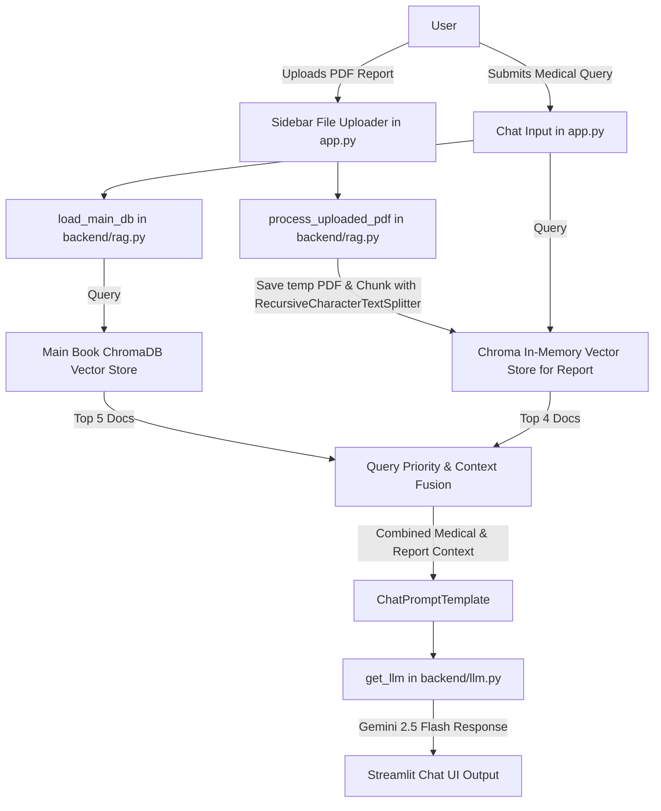

# 🩺 AI Medical Assistant with RAG & Report Analysis — Complete Project Documentation

This document contains a comprehensive breakdown, detailed architectural explanation, and full source code for every file in the **AI Medical Assistant with RAG & Report Analysis** project.

---

## 📐 Architecture Overview

The system is a **Dual-Vector-Store Retrieval-Augmented Generation (RAG)** medical query assistant built with Python, Streamlit, LangChain, ChromaDB, and Google Gemini LLMs.

### Key Components:
1. **Frontend / UI (`app.py`)**: Built using **Streamlit** to handle chat history, document uploads, context merging, dynamic retrieval routing based on user query keywords, prompt formatting, and rendering LLM answers.
2. **LLM Core (`backend/llm.py`)**: Initializes `ChatGoogleGenerativeAI` targeting `gemini-2.5-flash` with low temperature settings (`0.2`) for factual consistency.
3. **RAG Pipeline & Document Processing (`backend/rag.py`)**: Manages reading existing persistent vector stores (`ChromaDB`) and dynamically splitting/embedding newly uploaded patient PDF reports into temporary vector stores.
4. **Knowledge Base Indexing Script (`backend/index_books.py`)**: Offline script to ingest `data/medical_book.pdf` using `HuggingFaceEmbeddings` (`sentence-transformers/all-MiniLM-L6-v2`) and store persistent vectors in `db/`.

---

## 📊 High-Level Flow Chart



---

## 📁 File-by-File Detailed Explanation & Complete Content

---

### 1. `app.py`

* **File Location:** `app.py`
* **Purpose:** The main application entry point and user interface, powered by Streamlit.

#### Detailed Explanation:
* **Page Config & Header (Lines 1–9):** Imports required dependencies (`streamlit`, `backend.rag`, `backend.llm`, `ChatPromptTemplate`) and configures page title (`Medical Chatbot`) and icon.
* **LLM & Vector DB Initialization (Lines 10–16):** Instantiates the Gemini LLM via `get_llm()` and loads the main medical reference vector store into `st.session_state.main_db` so it is loaded only once per session.
* **Sidebar Upload (Lines 18–25):** Provides a file uploader allowing patients/doctors to upload medical reports in PDF format. Once uploaded, `process_uploaded_pdf()` is called, storing the result in `st.session_state.report_db`.
* **Chat Memory Management (Lines 26–33):** Maintains interaction history in `st.session_state.chat` and renders previous conversation turns using `st.chat_message`.
* **User Input & Multi-Retriever Querying (Lines 34–64):**
  * Retrieves top-5 relevant chunks (`docs1`) from the general medical knowledge base (`main_db`).
  * If a patient report has been uploaded, retrieves top-4 relevant chunks (`docs2`) from `report_db`.
  * **Priority Logic:** If the user query includes keywords like `"report"`, `"mri"`, or `"scan"`, the system prioritizes patient report context (`docs2 + docs1`). Otherwise, it prioritizes general medical textbook context (`docs1 + docs2`).
* **Context Formatting (Lines 66–73):** Helper function `format_docs()` formats document page content alongside metadata (e.g., page numbers).
* **Prompt Construction & Governance (Lines 75–104):** Formats a prompt instructing the AI assistant to give structured advice (clear explanation, report summary, severity insight, next steps, page citation) and appends a mandatory medical disclaimer.
* **LLM Execution & Response Rendering (Lines 105–113):** Invokes the LLM with `final_prompt`, appends the response to session memory, and displays it in the chat interface.

#### Complete File Code:

```python
import streamlit as st
from backend.rag import load_main_db, process_uploaded_pdf
from backend.llm import get_llm
from langchain_core.prompts import ChatPromptTemplate

# ---------------- UI ----------------
st.set_page_config(page_title="Medical Chatbot", page_icon="🩺")
st.title("🩺 Intelligent Healthcare Assistant")

# ---------------- LOAD LLM ----------------
llm = get_llm()

# ---------------- LOAD MAIN BOOK DB ----------------
if "main_db" not in st.session_state:
    st.session_state.main_db = load_main_db()

# ---------------- SIDEBAR UPLOAD ----------------
with st.sidebar:
    st.header("Upload Patient Report")
    uploaded_pdf = st.file_uploader("Upload MRI / Blood Report", type="pdf")

    if uploaded_pdf:
        st.session_state.report_db = process_uploaded_pdf(uploaded_pdf)
        st.success("Report uploaded successfully!")

# ---------------- CHAT MEMORY ----------------
if "chat" not in st.session_state:
    st.session_state.chat = []

for msg in st.session_state.chat:
    with st.chat_message(msg["role"]):
        st.write(msg["content"])

# ---------------- USER INPUT ----------------
query = st.chat_input("Ask a medical question")

if query:
    st.session_state.chat.append({"role": "user", "content": query})

    with st.chat_message("user"):
        st.write(query)

    # ---------------- RETRIEVERS ----------------
    main_retriever = st.session_state.main_db.as_retriever(
        search_kwargs={"k": 5}
    )

    docs1 = main_retriever.get_relevant_documents(query)

    # If report uploaded
    if "report_db" in st.session_state:
        report_retriever = st.session_state.report_db.as_retriever(
            search_kwargs={"k": 4}
        )
        docs2 = report_retriever.get_relevant_documents(query)

        # 🔥 PRIORITY LOGIC
        if "report" in query.lower() or "mri" in query.lower() or "scan" in query.lower():
            docs = docs2 + docs1   # report first
        else:
            docs = docs1 + docs2
    else:
        docs = docs1

    # ---------------- FORMAT CONTEXT ----------------
    def format_docs(docs):
        formatted = []
        for doc in docs:
            page = doc.metadata.get("page", "unknown")
            formatted.append(f"(Page {page}) {doc.page_content}")
        return "\n\n".join(formatted)

    context = format_docs(docs)

    # ---------------- PROMPT ----------------
    prompt = ChatPromptTemplate.from_template("""
You are an advanced AI medical assistant.

If a patient report is uploaded:
- Focus on report findings first
- Use medical knowledge as support

Context:
{context}

Question:
{question}

Provide:
1. Clear explanation
2. If report exists → summarize findings first
3. Severity insight
4. Suggested next steps
5. Mention page numbers if available

End with:
"I am not a doctor. Please consult a healthcare professional."
""")

    final_prompt = prompt.format(
        context=context,
        question=query
    )

    # ---------------- LLM RESPONSE ----------------
    response = llm.invoke(final_prompt)

    with st.chat_message("assistant"):
        st.write(response.content)

    st.session_state.chat.append(
        {"role": "assistant", "content": response.content}
    )
```

---

### 2. `backend/llm.py`

* **File Location:** `backend/llm.py`
* **Purpose:** Handles initialization and configuration of the Large Language Model.

#### Detailed Explanation:
* **Environment Loading (Lines 1–5):** Loads environment variables from `.env` using `dotenv`.
* **`get_llm()` Function (Lines 7–13):**
  * Initializes `ChatGoogleGenerativeAI` from `langchain_google_genai`.
  * Configures the model to use `gemini-2.5-flash`.
  * Sets `temperature=0.2` to minimize hallucination and generate precise clinical responses.
  * Reads `GOOGLE_API_KEY` from the environment.

#### Complete File Code:

```python
import os
from dotenv import load_dotenv
from langchain_google_genai import ChatGoogleGenerativeAI

load_dotenv()   

def get_llm():
    llm = ChatGoogleGenerativeAI(
        model="gemini-2.5-flash",
        temperature=0.2,
        google_api_key=os.getenv("GOOGLE_API_KEY")
    )
    return llm
```

---

### 3. `backend/rag.py`

* **File Location:** `backend/rag.py`
* **Purpose:** Core RAG functions for vector embedding generation, loading the persistent vector store, and dynamically processing user-uploaded PDFs.

#### Detailed Explanation:
* **Embedding Model (Lines 6–8):** Instantiates `HuggingFaceEmbeddings` using `sentence-transformers/all-MiniLM-L6-v2`. This model generates 384-dimensional vector representations locally without external API latency.
* **`load_main_db()` Function (Lines 10–16):** Connects to the local persistent Chroma database stored in the `db/` directory, which holds pre-indexed medical textbook embeddings.
* **`process_uploaded_pdf(file)` Function (Lines 18–37):**
  * Takes an uploaded file buffer from Streamlit, writes it temporarily to `temp_report.pdf`.
  * Loads text using `PyPDFLoader`.
  * Splits document text using `RecursiveCharacterTextSplitter` (chunk size = 800 characters, overlap = 150 characters).
  * Creates an in-memory `Chroma` collection containing the report's text vectors for immediate semantic search.

#### Complete File Code:

```python
from langchain_chroma import Chroma
from langchain_community.embeddings import HuggingFaceEmbeddings
from langchain_text_splitters import RecursiveCharacterTextSplitter
from langchain_community.document_loaders import PyPDFLoader

embeddings = HuggingFaceEmbeddings(
    model_name="sentence-transformers/all-MiniLM-L6-v2"
)

# Load main medical book DB
def load_main_db():
    vectordb = Chroma(
        persist_directory="db",
        embedding_function=embeddings
    )
    return vectordb

# Process uploaded patient report
def process_uploaded_pdf(file):
    with open("temp_report.pdf", "wb") as f:
        f.write(file.getbuffer())

    loader = PyPDFLoader("temp_report.pdf")
    docs = loader.load()

    splitter = RecursiveCharacterTextSplitter(
        chunk_size=800,
        chunk_overlap=150
    )
    splits = splitter.split_documents(docs)

    report_db = Chroma.from_documents(
        documents=splits,
        embedding=embeddings
    )

    return report_db
```

---

### 4. `backend/index_books.py`

* **File Location:** `backend/index_books.py`
* **Purpose:** An offline database preparation script that ingests reference medical documents into a persistent Chroma vector database.

#### Detailed Explanation:
* **PDF Loading (Lines 6–9):** Loads target PDF reference material (`data/medical_book.pdf`) via `PyPDFLoader`.
* **Chunking & Metadata Tagging (Lines 11–20):**
  * Breaks down large book pages into manageable chunks of 800 characters with 150 character overlap.
  * Explicitly ensures every chunk carries page metadata (`metadata["page"]`).
* **Vector Store Persistence (Lines 22–36):** Computes embeddings using `sentence-transformers/all-MiniLM-L6-v2` and persists the vector index into the local `db/` directory.

#### Complete File Code:

```python
from langchain_community.document_loaders import PyPDFLoader
from langchain_text_splitters import RecursiveCharacterTextSplitter
from langchain_community.embeddings import HuggingFaceEmbeddings
from langchain_chroma import Chroma

print("Loading book...")

loader = PyPDFLoader("data/medical_book.pdf")
docs = loader.load()

print("Splitting text...")

splitter = RecursiveCharacterTextSplitter(
    chunk_size=800,
    chunk_overlap=150
)
splits = splitter.split_documents(docs)

for i, doc in enumerate(splits):
    doc.metadata["page"] = doc.metadata.get("page", i)

print("Creating embeddings...")

embeddings = HuggingFaceEmbeddings(
    model_name="sentence-transformers/all-MiniLM-L6-v2"
)

vectordb = Chroma.from_documents(
    documents=splits,
    embedding=embeddings,
    persist_directory="db"
)

print("✅ BOOK INDEXED SUCCESSFULLY")
```

---

### 5. `requirements.txt`

* **File Location:** `requirements.txt`
* **Purpose:** Lists Python package dependencies for environment replication.

#### Complete File Content:
*(Currently empty or clean configuration template)*

#### Recommended Production Dependencies:
```text
streamlit
langchain
langchain-community
langchain-core
langchain-chroma
langchain-google-genai
sentence-transformers
pypdf
python-dotenv
chromadb
```

---

### 6. `.gitignore`

* **File Location:** `.gitignore`
* **Purpose:** Excludes temporary files, local vector storage, credentials, and dataset files from version control.

#### Complete File Code:

```gitignore
# Environment
.env

# Python
__pycache__/
*.pyc

# Vector DB
db/
*.sqlite3

# Data files
data/
*.pdf

# Temp files
temp_report.pdf

# OS
.DS_Store
Thumbs.db
```

---

### 7. `README.md`

* **File Location:** `README.md`
* **Purpose:** Documentation for project setup, usage instructions, feature overview, and disclaimers.

#### Complete File Code:

```markdown
# 🩺 AI Medical Assistant with RAG & Report Analysis

An AI-powered medical assistant that analyzes medical reports and answers health-related questions using **Retrieval-Augmented Generation (RAG)** and **Large Language Models (LLMs)**.

This project enables users to upload medical reports and receive intelligent insights by combining document retrieval with generative AI.

---

## 🚀 Features

* 📄 **Medical Report Analysis** – Upload and analyze medical reports.
* 🤖 **AI Question Answering** – Ask health-related questions about the reports.
* 🔎 **RAG Pipeline** – Retrieves relevant medical knowledge before generating answers.
* 🧠 **LLM Integration** – Uses a large language model for intelligent responses.
* 📚 **Medical Knowledge Base** – Uses a medical book dataset for retrieval.

---

## 🏗️ Project Structure

```
medical-ai-assistant
│
├── backend/
│   ├── index_books.py       # Index medical books into vector database
│   ├── rag.py               # Retrieval-Augmented Generation pipeline
│   └── llm.py               # LLM integration
│
├── models/                  # ML / embedding models
├── app.py                   # Main application
├── requirements.txt         # Python dependencies
├── .gitignore
└── README.md
```

---

## ⚙️ Tech Stack

* **Python**
* **LLMs**
* **Retrieval-Augmented Generation (RAG)**
* **Vector Database (ChromaDB)**
* **Embeddings**
* **Document Processing**

---

## 📦 Installation

Clone the repository:

```
git clone https://github.com/Dharmadhaashan/AI-Medical-Assistant-with-RAG-Report-Analysis.git
cd AI-Medical-Assistant-with-RAG-Report-Analysis
```

Create a virtual environment:

```
python -m venv venv
```

Activate it:

**Windows**

```
venv\Scripts\activate
```

**Mac/Linux**

```
source venv/bin/activate
```

Install dependencies:

```
pip install -r requirements.txt
```

---

## 🔑 Environment Variables

Create a `.env` file in the root directory and add your API key:

```
API_KEY=your_api_key_here
```

---

## 📚 Adding Medical Data

Place your medical documents or PDFs inside the `data/` directory before indexing.

Then run:

```
python backend/index_books.py
```

This will create the vector database for retrieval.

---

## ▶️ Running the Application

Start the application:

```
python app.py
```

You can then upload reports and interact with the AI assistant.

---

## 🧠 How It Works

1. Medical documents are converted into **embeddings**.
2. The embeddings are stored in a **vector database (ChromaDB)**.
3. When a user asks a question:

   * Relevant documents are retrieved.
   * The LLM generates an answer using the retrieved context.

This approach improves accuracy compared to normal LLM responses.

---

## 📌 Future Improvements

* Medical entity extraction
* Multi-document report analysis
* Improved medical knowledge base
* Web interface
* Deployment with Docker / Cloud

---

## ⚠️ Disclaimer

This project is for **educational and research purposes only** and should **not be used as a substitute for professional medical advice**.

---

## 👨‍💻 Author

**Dharmadhaashan**

GitHub:
https://github.com/Dharmadhaashan

---

⭐ If you find this project useful, consider giving it a star!
```
